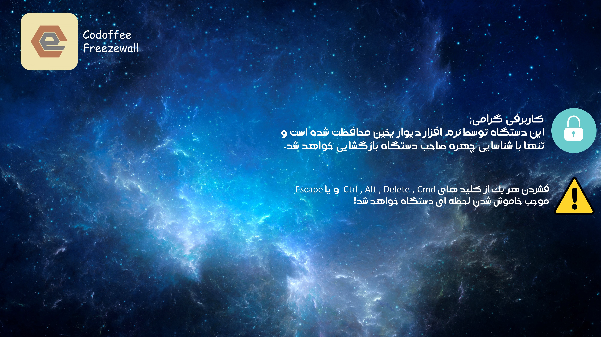
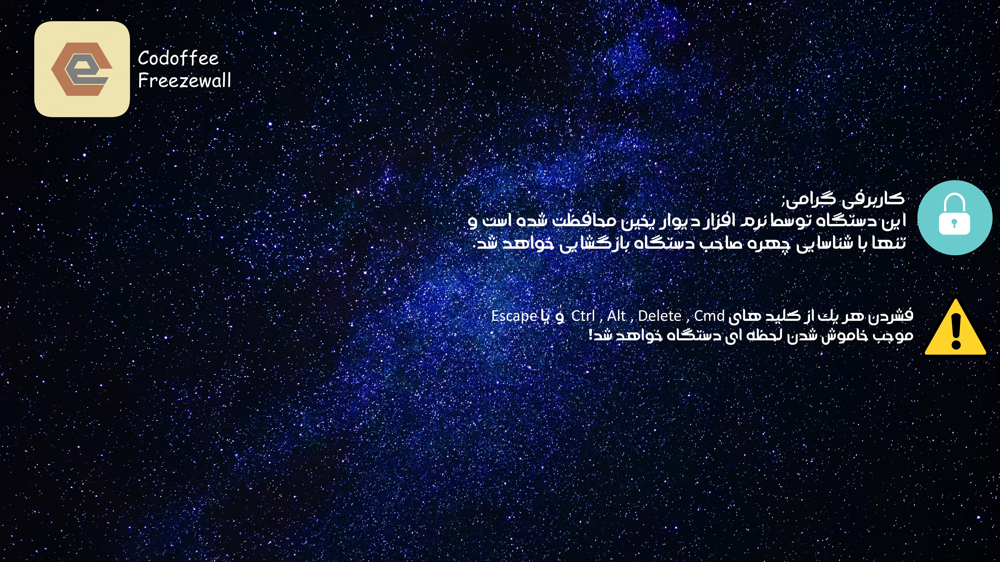

<!--- mdformat-toc start --slug=github --->

<div align="center">


# FreezeWall(AI BASED FACELOCK)

Locks The Computer When Runs Completely & Unlocks Just with Recognizing The Owner's Face(s)\
[](https://github.com/ASafarzadeh/AIFaceLock)
[](https://github.com/ASafarzadeh/AIFaceLock)
[](https://github.com/ASafarzadeh/AIFaceLock)
[](https://ko-fi.com/D1D14LUVM)\
[نسخه فارسی](./Readme-fa.md)\
</div>

> Complete No IRSENSOR needed AI Screen Recognizer With 90+% Of Correct Recognition

## What FreezeWall Does

1. Capture about 200 pics from the owner and learn from them
2. Apply Security Layers and Usese Neural Network Learning Based On Harcascade
3. When Starts, Locks the Computer Completely while The Owner(s)'s Face is not recognized.

> _⚠ Cause This Program Doesn't Need Any IR SENSOR and Just uses a simple webcam, It Won't Work in low Light_

## Prerequisites

- Python 3.6 or above (added to PATH)
- Other Requirments Mentioned in requirments.txt

> **_This Program is not usable in ORGANIZATIONS OR COMPANIES. Main Version IS NOT PUBLISHED and this is just for study usage_**

## Installation

### Installing Python

- [Download Python(3.6.5 Recommended)](https://python.org)

### Installing Requirments

- Installing All Packages Once:

  ```bash
  py -m pip install -r {PATH TO requirments.txt}
  ```

- Install 1 by 1: **(NOT RECOMMENDED)**
install keyboard,pynput,playsound,pyautogui,jdatetime,keyboard,screeninfo,opencv-python,numpy,pillow,hashlib by this pattern:
  ```bash
  pip install [packagename]
  ```

If you have trouble installing Freezewall Contact Support:
[discord server](https://discord.gg/fY8QUqMzkT)


## Usage

- #### First Run Settings.py
> Complete Face Learning Progress

- #### Then Run Listener.py

  ```bash
  Now Computer Will Lock by pressing WIN+`
  ```

## Contributor Guide

Interested in contributing? Make any changes That u like, And then send it to Our [discord server](https://discord.gg/fY8QUqMzkT) as a zip file😊

## Authors

1. [@ArizLOLO](https://github.com/AriaIzanlou) for Coding UI and Working on Designs and OPENCV
2. [@ME😁](https://github.com/ASafarzadeh) for Face Recognition&LOCK Alogorithm and Photo's Design

# Gallery




