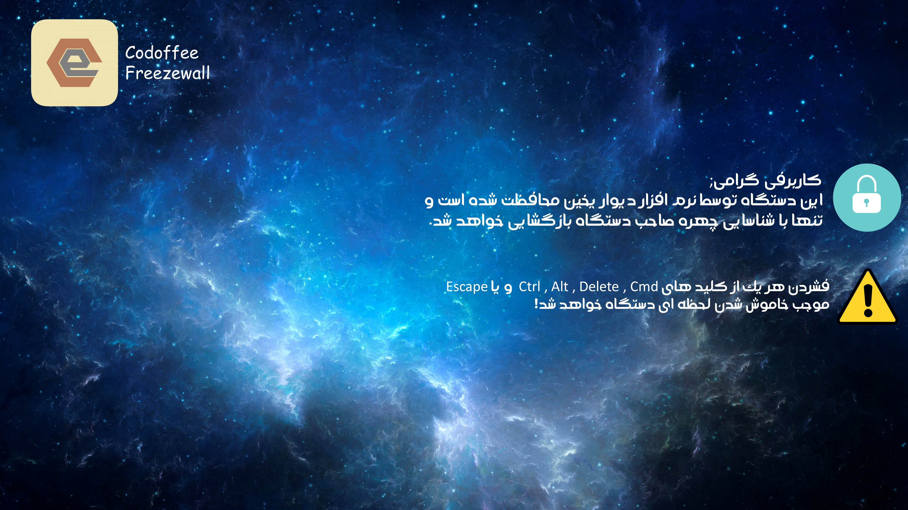
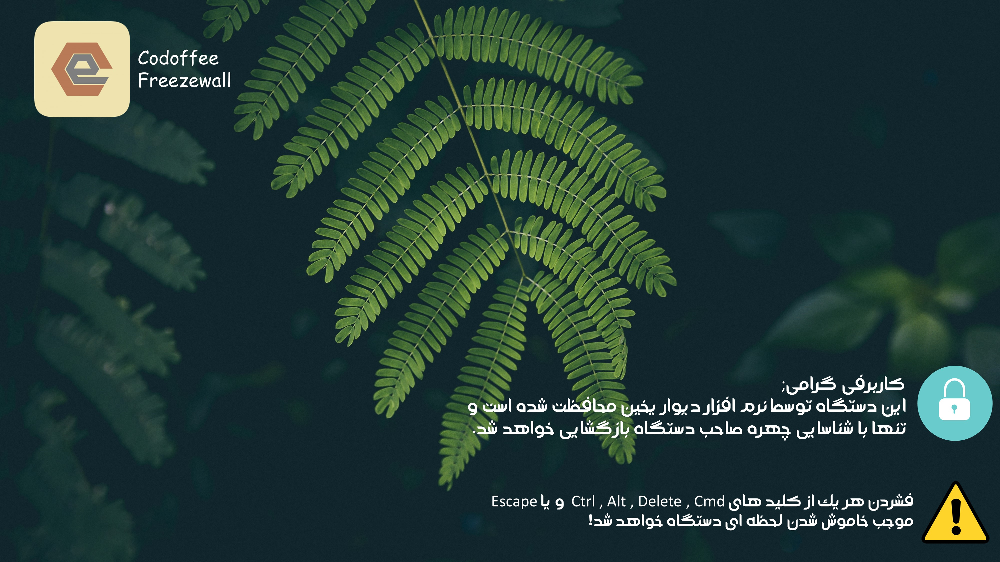
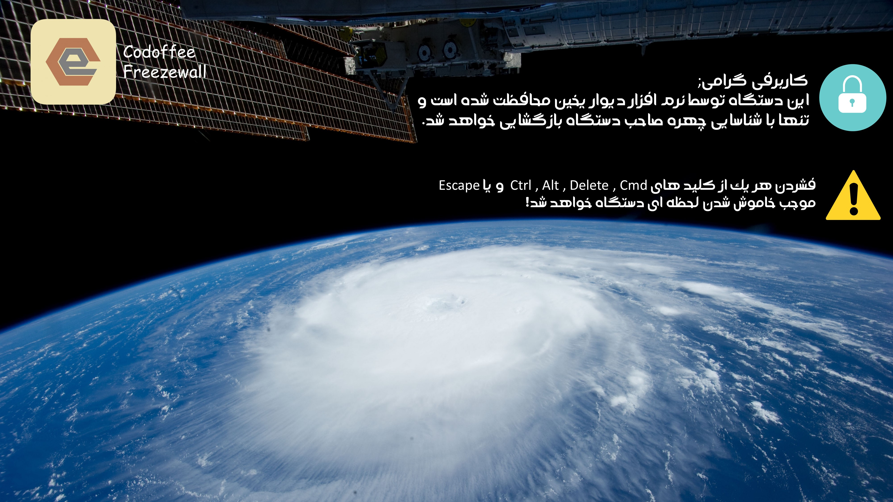
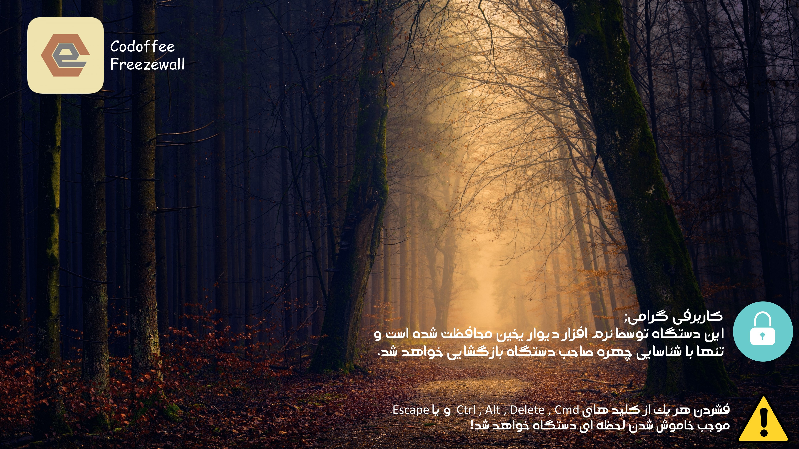
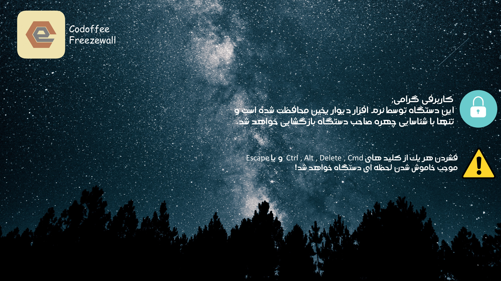
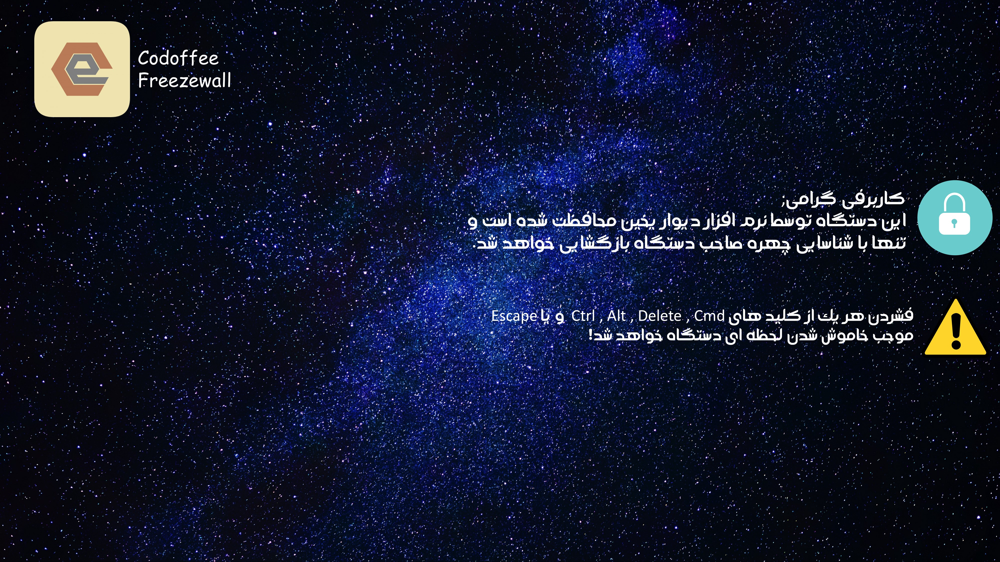

<!--- mdformat-toc start --slug=github --->

<div align="center">


# دیوار یخین(تشخیص چهره بر مبنای هوش مصنوعی)

قفل کامل کامپیوتر تا زمان شناسایی چهره ثبت شده از صاحب دستگاه\
[](https://github.com/ASafarzadeh/AIFaceLock)
[](https://github.com/ASafarzadeh/AIFaceLock)
[](https://github.com/ASafarzadeh/AIFaceLock)
[](https://ko-fi.com/D1D14LUVM)
</div>

> بدون نیاز به سنسور مادون قرمز جهت تشخیص چهره با ضریب موفقیت بالای 90 درصد
[English Version](./Readme.md)

## مراحل کار نرم افزار

1. ثبت حدود 200 تصویر از فرد و یادگیری بر مبنای آنها
2. شناسایی چهره ها بر مبنای HarCascade
3. وقتی lock.pyw اجرا شود، تا زمانی که چهره صاحب دستگاه شناسایی نشده دستگاه قفل گشایی نخواهد شد

> _⚠ بدلیل وبکم محور بودن این برنامه و عدم نیاز به سنسور مادون قرمز، قابل استفاده در نور کم نیست_
> 
> **_این برنامه برای استفاده سازمان ها و موارد امنیتی مناسب نیست. نسخه کامل این نرم افزار منتشر نشده و نمی شود ونسخه عرضه شده به شما صرفا جهت یادگیری و پیشبرد دانش برنامه نویسی کشور است_**

## پیش نیاز ها

- پایتون 3.6.5 به بالا
- باقی پیش نیاز ها در requirments.txt ذکر شده است


## نصب و راه اندازی

### نصب پایتون

- [دانلود پایتون(3.6.5 پیشنهاد می شود)](https://python.org)

### نصب پیش نیاز ها

- نصب یکجای همگی

  ```bash
  py -m pip install -r {PATH TO requirments.txt}
  ```

- نصب یک به یک: **(پیشنهاد نمیشود)**
پکیج های  keyboard,pynput,playsound,pyautogui,jdatetime,keyboard,screeninfo,opencv-python,numpy,pillow,hashlib را با الگوی زیر نصب کنید:
  ```bash
  pip install [نام پکیج]
  ```

در صورت وجود هر گونه مشکل از طریق سرور دیسکورد زیر مشکلات رابا ما مطرح کنید:
[discord server](https://discord.gg/fY8QUqMzkT)


## استفاده

- #### اول Settings.py را اجرا کنید
> مراحل را کامل کنید

- #### اکنون فایل Listener.py را اجرا کنید

  ```bash
  کامپیوتر اکنون با فشردن WIN+` قفل خواهد شد
  ```

## راهنمای مشارکت کننده ها

اگه دوست داشتین و در برنامه تغییر مثبتی ایجاد کردین میتونید اون رو از طریق  [سرور دیسکورد ما](https://discord.gg/fY8QUqMzkT) برامون بصورت یه فایل زیپ ارسال کنید😊

## تشکر ها

1. [از آریا](https://github.com/AriaIzanlou) برای کد زدن کل ui برنامه و تغییرات قشنگ در صفحه تغییر چهره
2. [از خودم😁](https://github.com/ASafarzadeh) برای نوشتن الگوی تشخیص چهره و هوش مصنوعی و طراحی اسکرین سیور ها

# گالری تصاویر






